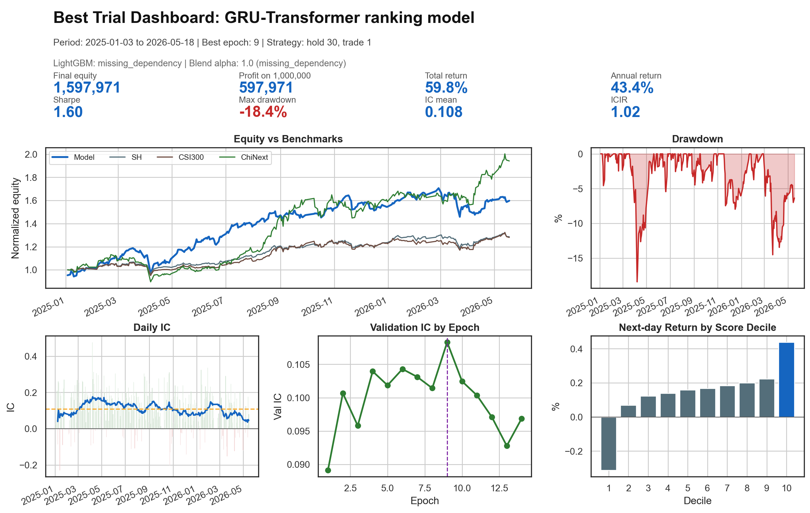
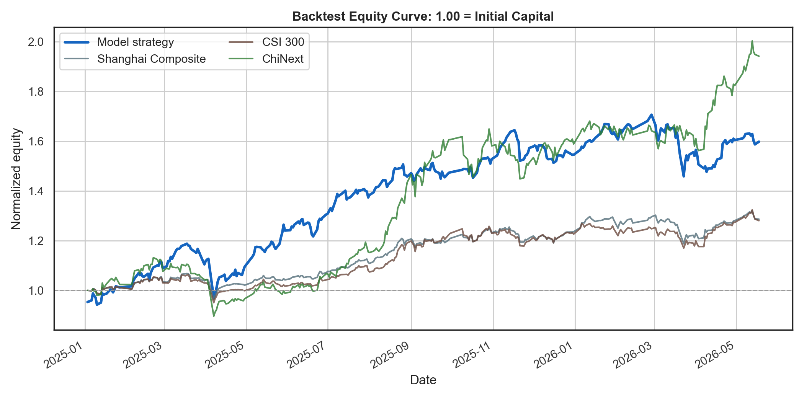
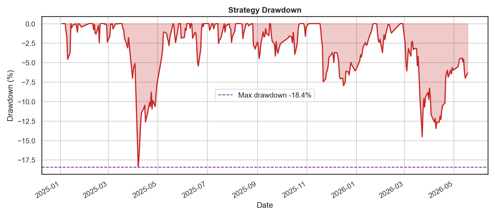
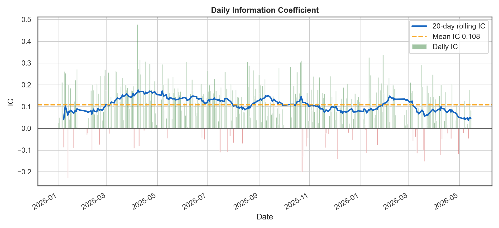
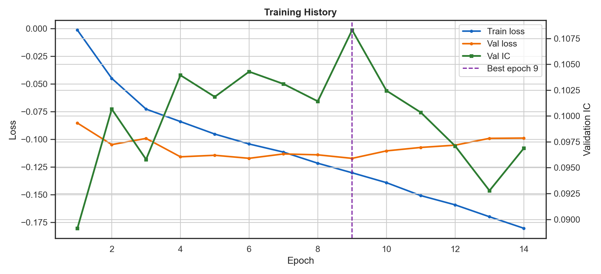
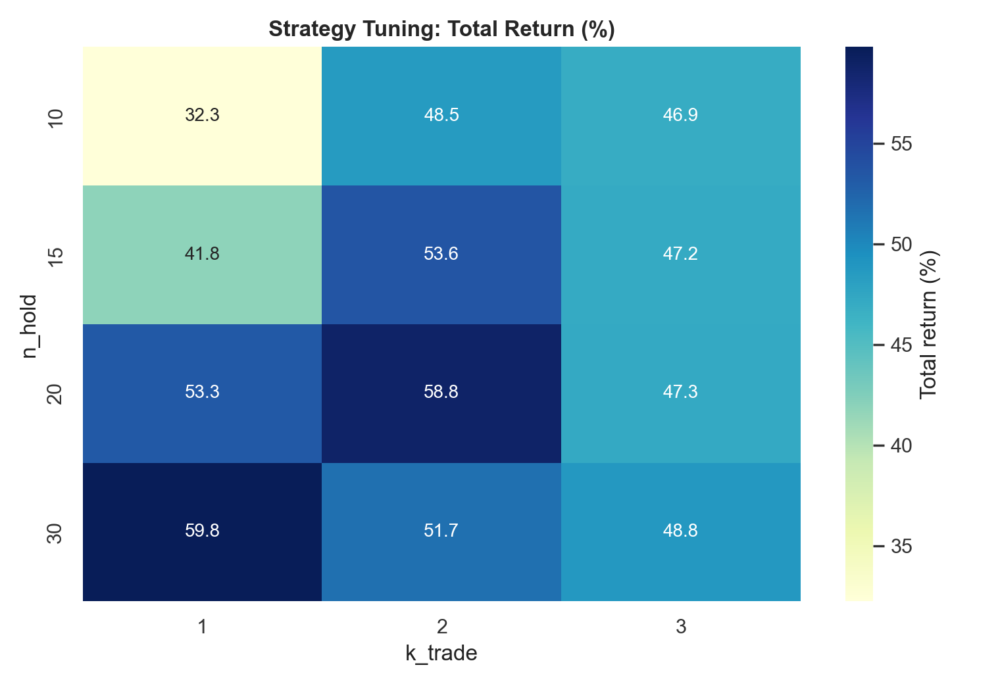
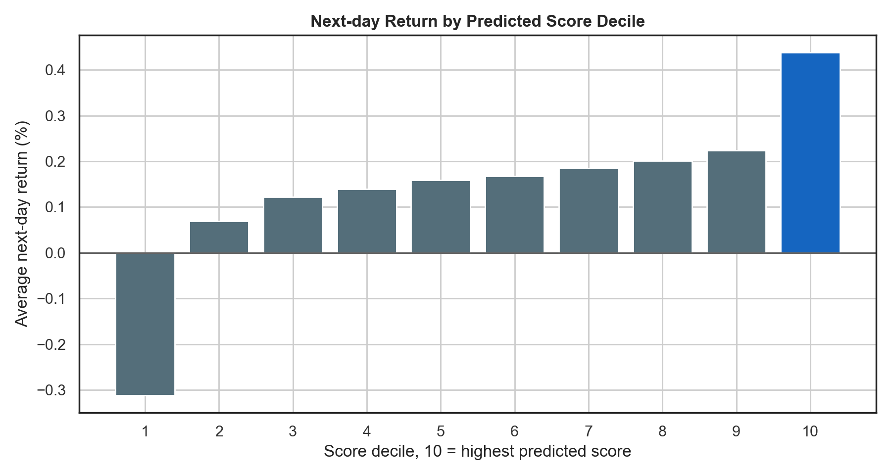

# Best Trial Visual Summary

## Bottom Line

Using the downloaded `best-trails` result, the backtest starts with **1,000,000** and ends at **1,597,971**, a simulated profit of **597,971** over 2025-01-03 to 2026-05-18.

This is a historical backtest, not a guaranteed live trading return.

## Key Metrics

| Metric | Value |
|---|---:|
| Total return | 59.80% |
| Annual return | 43.35% |
| Sharpe ratio | 1.605 |
| Max drawdown | -18.41% |
| Daily win rate | 60.37% |
| IC mean | 0.1083 |
| ICIR | 1.0167 |
| Best epoch | 9 |
| Best strategy | n_hold=30, k_trade=1 |

## Benchmark Comparison

| Series | Total Return | Sharpe | Max Drawdown |
|---|---:|---:|---:|
| Model strategy | 59.80% | 1.605 | -18.41% |
| Shanghai Composite | 28.65% | 1.496 | -9.71% |
| CSI 300 | 28.03% | 1.326 | -10.49% |
| ChiNext | 94.19% | 1.937 | -20.79% |

## Model Setup

- Model: `gru_transformer`
- d_model: `96`
- layers: `2`
- target: `label_rank`
- loss: `ic`
- LightGBM status: `missing_dependency`
- Blend: `best_alpha=1.0`, reason `missing_dependency`

## Figures

